# Simple weather report rest service

### There are two things you have to do before launching project
* #### Start mysql server and create database

* #### Register on https://openweathermap.org and get api key

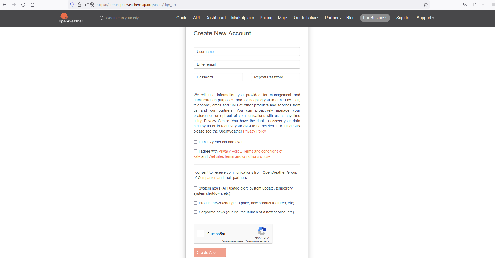

### Settings 

* ####  Set database name, server password and username in application.properties
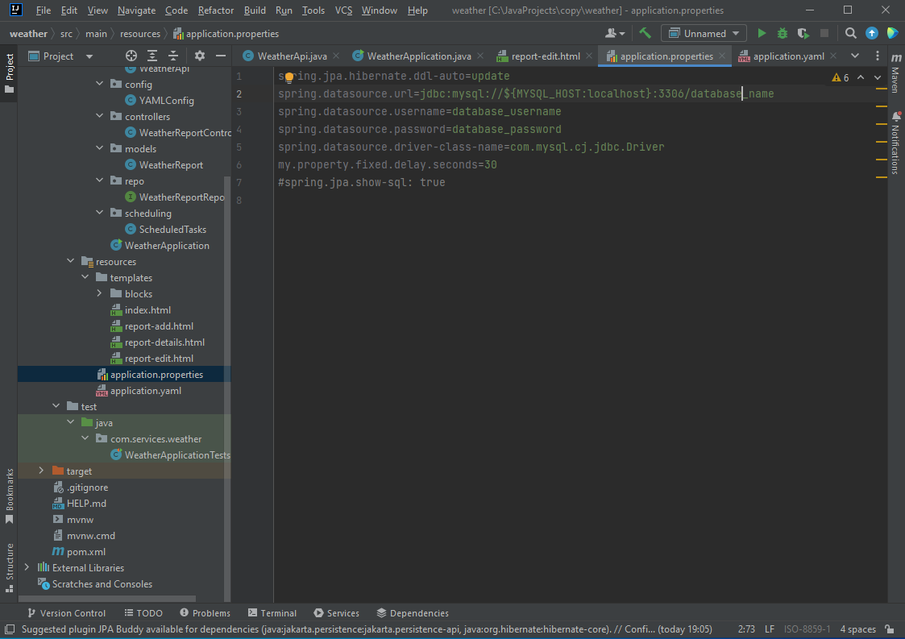

* ####  Set api key in application.yaml
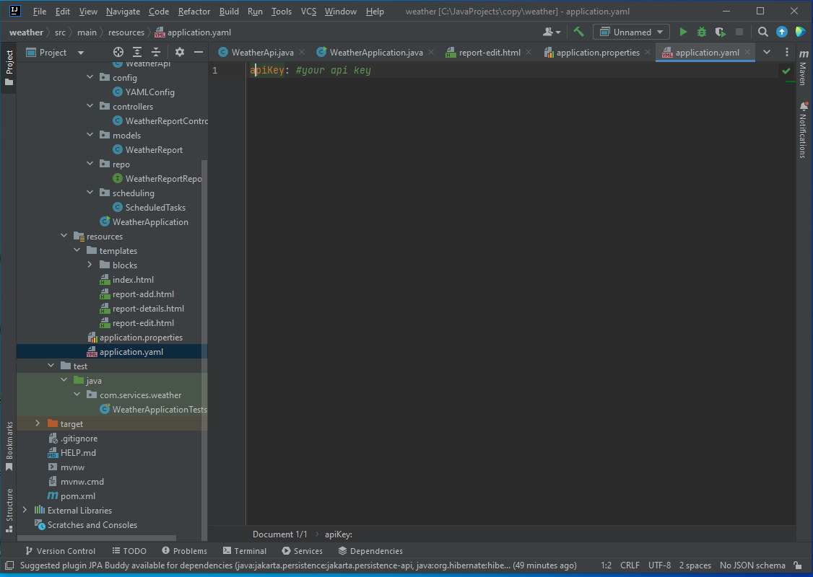

### Rest service work example

* #### Start service in IDE

* #### All reports are shown on start page

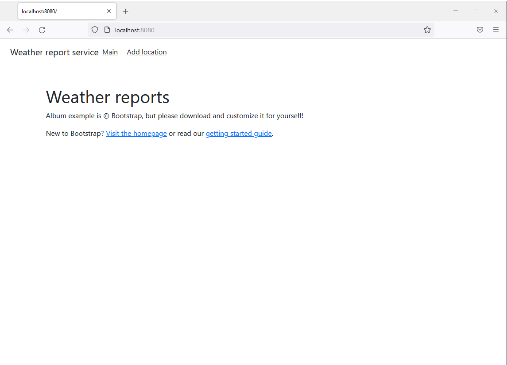

* #### We can add a report by pushing 'add location'

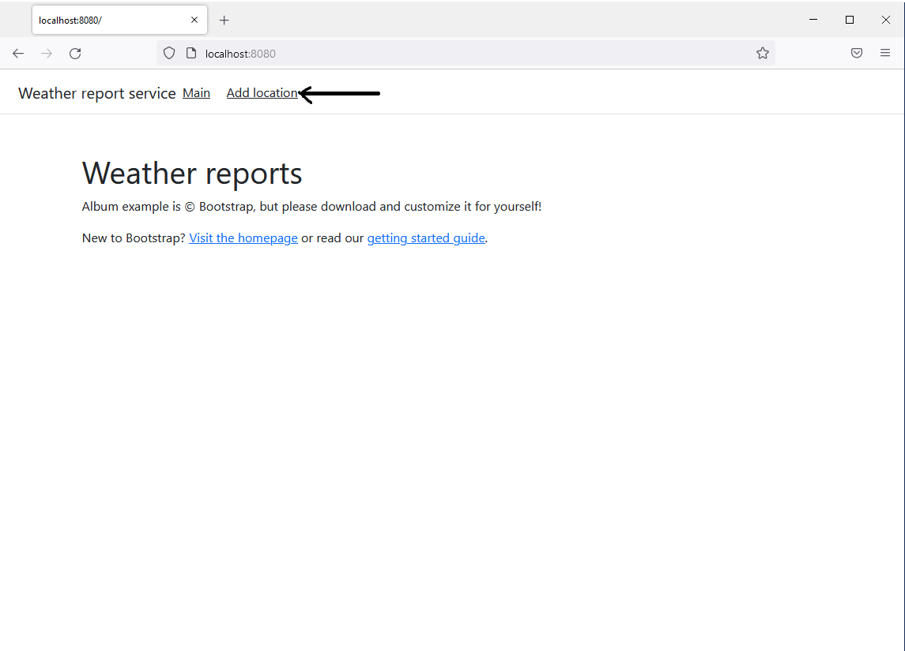

* #### Enter the data and push 'add place'
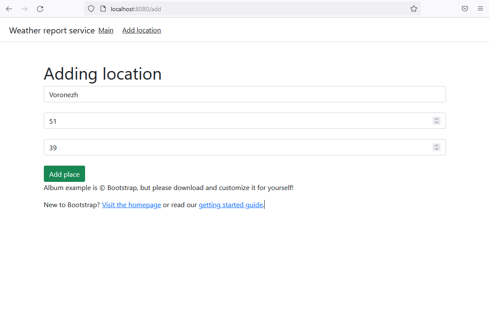

* #### Now we get our report
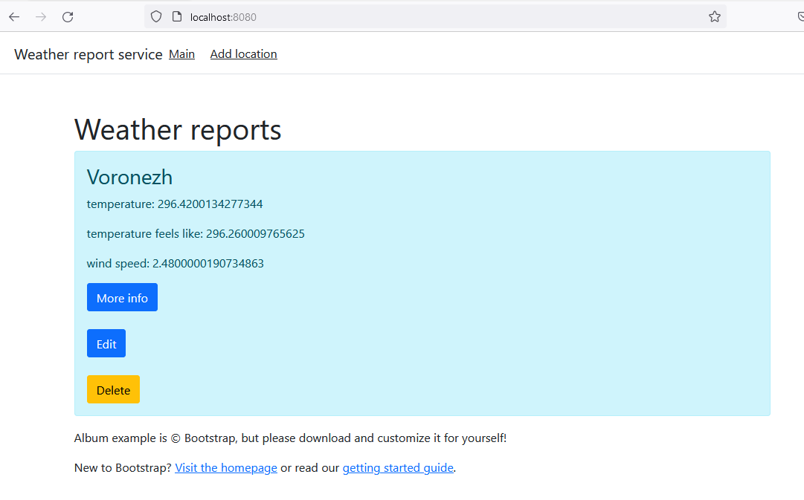

We can get more info
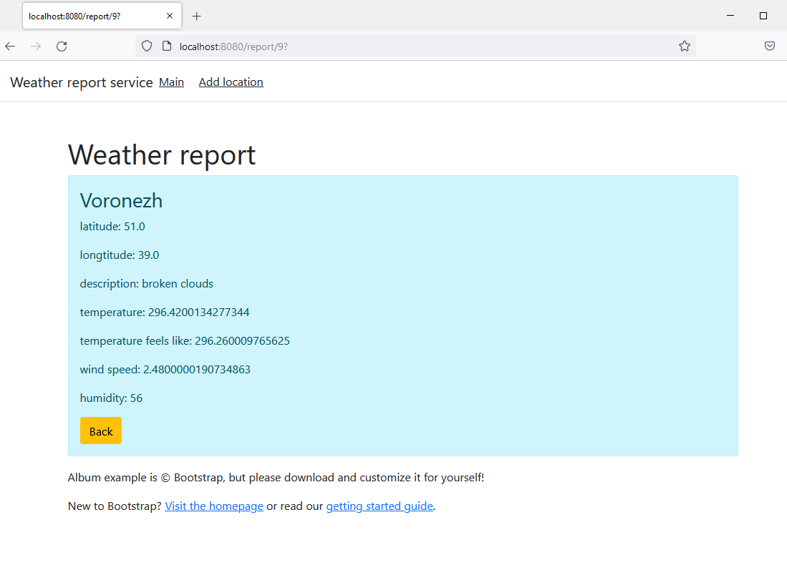

Edit it
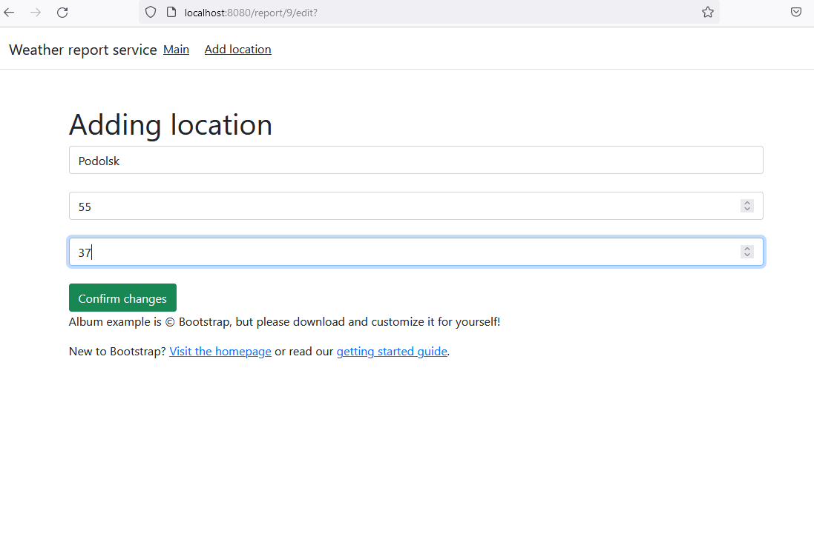
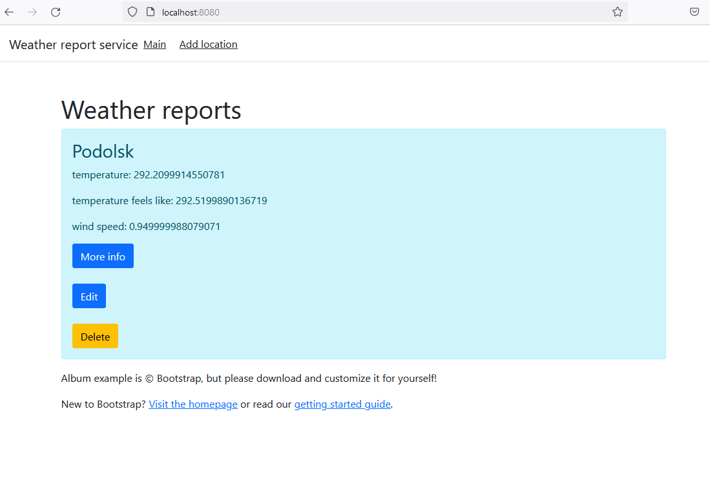

Or delete
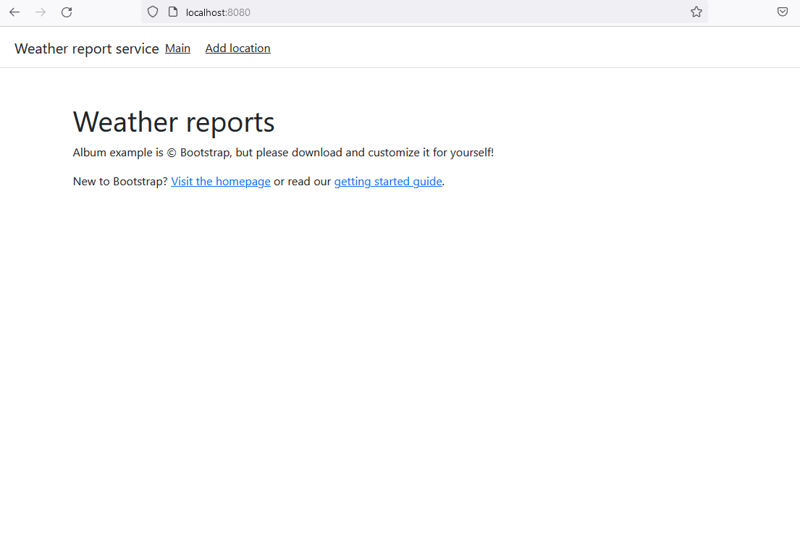

